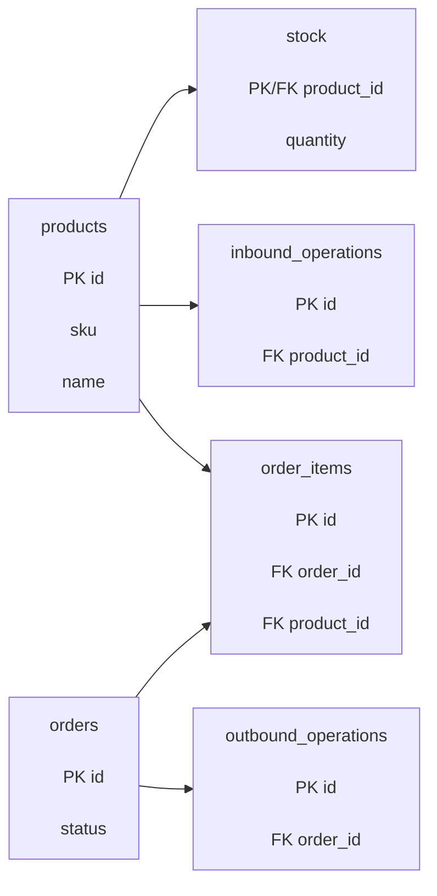

# WMS Database Structure
  

```mermaid

flowchart LR

  

    PRODUCTS["products

    PK id

    sku

    name"]

  

    STOCK["stock

    PK/FK product_id

    quantity"]

  

    INBOUND["inbound_operations

    PK id

    FK product_id"]

  

    ORDERS["orders

    PK id

    status"]

  

    ITEMS["order_items

    PK id

    FK order_id

    FK product_id"]

  

    OUTBOUND["outbound_operations

    PK id

    FK order_id"]

  

    PRODUCTS --> STOCK

    PRODUCTS --> INBOUND

    PRODUCTS --> ITEMS

    ORDERS --> ITEMS

    ORDERS --> OUTBOUND

```